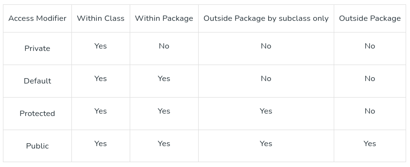

# Sintaxe Básica Java / Java Basic Syntax

## Classe / Class

**PT-BR**  
A classe é um modelo (plano) da instância de uma classe (objeto). Pode ser definida como um modelo lógico que compartilha propriedades e métodos comuns.

- Exemplo1: O modelo da casa é uma classe.
- Exemplo2: No mundo real, Alice é um objeto da classe "Humano".

***

**EN-US**  
The class is a blueprint (plan) of the instance of a class (object). It can be defined as a logical template that share common properties and methods.

- Example1: Blueprint of the house is class.
- Example2: In real world, Alice is an object of the “Human” class.

## Objeto / Object
**PT-BR**  
O objeto é uma instância de uma classe. É uma entidade que possui comportamento e estado.

- Exemplo: Cachorro, Gato, Macaco etc. são objetos da classe "Animal".
- Comportamento: Correr.

***

**EN-US**  
The object is an instance of a class. It is an entity that has behavior and state.

- Example: Dog, Cat, Monkey etc. are the object of “Animal” class.
- Behavior: Run.

## Método / Method
**PT-BR**  
O comportamento de um objeto é o método.

- Exemplo: O indicador de combustível indica a quantidade de combustível restante no carro.

***

**EN-US**  
The behavior of an object is the method.

- Example: The fuel indicator indicates the amount of fuel left in the car.


## Variável / Variable
**PT-BR**  
Uma variável é um local na memória que é usado para armazenar dados. O nome da variável é usado para acessar e manipular seus dados.

***

**EN-US**  
Every object has its own unique set of instance variables. The state of an object is generally created by the values that are assigned to these instance variables.

## Comentários em Java / Comments in Java

**PT-BR**  
Existem três tipos de comentários em Java:

**Comentário de uma linha**: `// System.out.println("This is an comment.");`

**Comentário de várias linhas**:
```
/*
    System.out.println("This is the first line comment.");
    System.out.println("This is the second line comment.");
*/
```

**Comentário de documentação**: `/** documentation */`

***

**EN-US**  
There are three types of comments in Java:

**Single-line comment**: `// System.out.println("This is an comment.");`

**Multi-line Comment**:
```
/*
    System.out.println("This is the first line comment.");
    System.out.println("This is the second line comment.");
*/
```

**Documentation Comment (also called a doc comment)**: `/** documentation */`

## Nome do Arquivo Fonte / Source File Name

**PT-BR**  
O nome de um arquivo fonte deve corresponder exatamente ao nome da classe pública com a extensão .java. O nome do arquivo pode ser um nome diferente se não tiver nenhuma classe pública. Suponha que você tenha uma classe pública GFG:

```
GFG.java // sintaxe válida
gfg.java // sintaxe inválida
```

***

**EN-US**  
The name of a source file should exactly match the public class name with the extension of .java. The name of the file can be a different name if it does not have any public class. Assume you have a public class GFG:

```
GFG.java // valid syntax
gfg.java // invalid syntax
```

## Sensibilidade a maiúsculas e minúsculas / Case Sensitivity
**PT-BR**  
Java é uma linguagem sensível a maiúsculas e minúsculas, o que significa que os identificadores AB, Ab, aB e ab são diferentes em Java. Exemplo:
```
System.out.println("GeeksforGeeks"); // sintaxe válida
system.out.println("GeeksforGeeks"); // sintaxe inválida porque a primeira letra da palavra-chave System é sempre maiúscula.
```
***

**EN-US**  
Java is a case-sensitive language, which means that the identifiers AB, Ab, aB, and ab are different in Java. Example:
```
System.out.println("GeeksforGeeks"); // valid syntax
system.out.println("GeeksforGeeks"); // invalid syntax because of the first letter of System keyword is always uppercase. 
```

## Nomes de Classes / Class Names
**PT-BR**  
A primeira letra da classe deve estar em maiúscula (minúscula é permitida, mas desencorajada).

Se várias palavras forem usadas para formar o nome da classe, a primeira letra de cada palavra interna deve estar em maiúscula. Os sublinhados são permitidos, mas não recomendados. Também são permitidos números e símbolos monetários, embora estes últimos também sejam desencorajados porque são usados para um propósito especial (para classes internas e anônimas).

Exemplo:
```
class MyJavaProgram    // sintaxe válida
class 1Program         // sintaxe inválida
class My1Program       // sintaxe válida
class $Program         // sintaxe válida, mas desencorajada
class My$Program       // sintaxe válida, mas desencorajada (classe interna Program dentro da classe My)
class myJavaProgram    // sintaxe válida, mas desencorajada
```

***

**EN-US**  
The first letter of the class should be in Uppercase (lowercase is allowed but discouraged).

If several words are used to form the name of the class, each inner word’s first letter should be in Uppercase. Underscores are allowed, but not recommended. Also allowed are numbers and currency symbols, although the latter are also discouraged because they are used for a special purpose (for inner and anonymous classes).

Example:
```
class MyJavaProgram    // valid syntax
class 1Program         // invalid syntax
class My1Program       // valid syntax
class $Program         // valid syntax, but discouraged
class My$Program       // valid syntax, but discouraged (inner class Program inside the class My)
class myJavaProgram    // valid syntax, but discouraged
```

## public static void main(String [] args)
**PT-BR**  
O método main() é o ponto de entrada principal em um programa Java; é aqui que o processamento começa.

***

**EN-US**  
The method main() is the main entry point into a Java program; this is where the processing starts. 

## Nomes de Métodos / Method Names
**PT-BR**  
Todos os nomes de métodos devem começar com uma letra minúscula (maiúscula também é permitida, mas minúscula é recomendada).

Se várias palavras forem usadas para formar o nome do método, a primeira letra de cada palavra interna deve estar em maiúscula. Os sublinhados são permitidos, mas não recomendados. Também são permitidos números e símbolos monetários.

Exemplo:
```
public void employeeRecords() // sintaxe válida
public void EmployeeRecords() // sintaxe válida, mas desencorajada
```

***

**EN-US**  
All the method names should start with a lowercase letter (uppercase is also allowed but lowercase is recommended).

If several words are used to form the name of the method, then each first letter of the inner word should be in Uppercase. Underscores are allowed, but not recommended. Also allowed are digits and currency symbols.

Example:
```
public void employeeRecords() // valid syntax
public void EmployeeRecords() // valid syntax, but discouraged
```

## Modificadores de Acesso / Access Modifiers
**PT-BR**  

Modificadores de acesso controlam o escopo da classe e dos métodos.

- Modificadores de acesso: default, public, protected, private.
- Modificadores não acessíveis: final, abstract, static, transient, synchronized, volatile, native.



***

**EN-US**  

Access Modifiers control the scope of the class and methods.

- Access Modifiers: default, public, protected, private.
- Non-access Modifiers: final, abstract, static, transient, synchronized, volatile, native.

